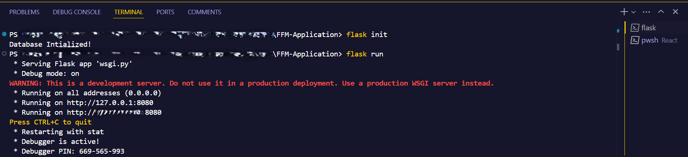
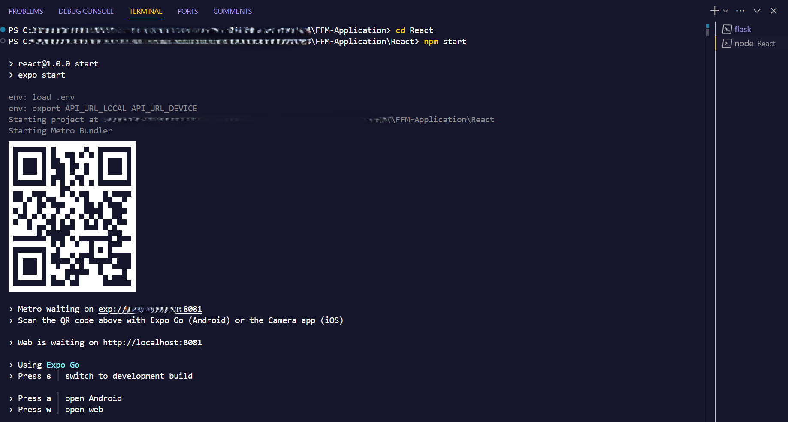

[](https://gitpod.io/#https://github.com/Chroma-Corps/FFM-Application)
<a href="https://render.com/deploy?repo=https://github.com/Chroma-Corps/FFM-Application">
  
</a>

<!--  -->

# Dependencies
* Python 3 and pip
* Expo CLI (npm install -g expo-cli)
* Python packages listed in requirements.txt

# Installing Dependencies
```bash
$ pip install -r requirements.txt
```

# Running the Project 

To start the project, follow these steps in order:

## 1. Setting Up and Running Flask
First, initialize the Flask application by running: 

```bash
$ flask init
```  
This command prepares the backend by setting up any necessary configurations or database migrations.  

Next, start the Flask server with:  

```bash
$ flask run
```  
This will launch the backend, making it ready to handle requests. You should see the server running, listening for incoming connections.  



## 2. Starting the React Native Frontend
Once the backend is running, open another terminal and navigate to the React folder:  

```bash
$ cd React
```  
This ensures you're in the correct folder before starting the frontend.  

Now, launch the React Native development server with:  

```bash
$ npm start
```  
This will initialize the Metro bundler, allowing you to run the mobile app on an emulator, on the web browser or a physical device.

If everything is set up correctly, the app should now be ready for interaction.

